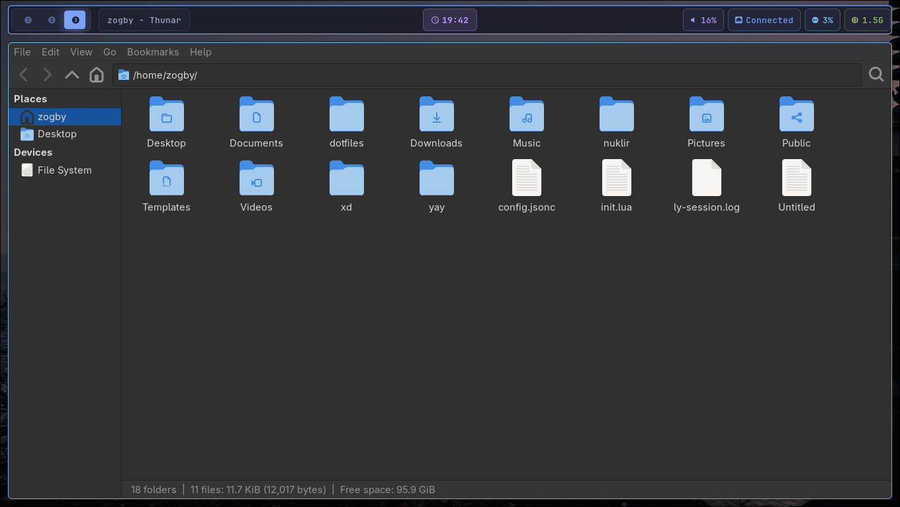

# My Dotfiles

Personal configuration for Arch Linux with Hyprland.

## Tools Used

  - Shell: fish with a custom prompt
  - Terminal: kitty
  - Window Manager: Hyprland
  - Launcher: rofi
  - Status Bar: waybar
  - Editor: neovim

-----

### Dotfiles Preview

Here are a few views of my dotfiles configuration:





<div align="center">
  
  
  
  
  
  
   
</div>

[](screenshots/ss1.png)
[](screenshots/ss2.png)
[](screenshots/ss3.png)
[](screenshots/ss4.png)
[](screenshots/ss5.png)
[](screenshots/ss6.png)
[](screenshots/ss7.png)

## Folder Structure

```
.
├── hyprland/
├── kitty/
├── neovim/
├── rofi/
├── waybar/
└── fish/
```

-----

## How to Install (Using GNU Stow) 🐧

### 1\. Prerequisites

Make sure you have GNU Stow installed. If not, install it using your package manager.

**Arch Linux:**

```bash
sudo pacman -S stow
```

**Debian/Ubuntu:**

```bash
sudo apt install stow
```

### 2\. Clone the Repository

Clone this dotfiles repository into your home directory.

```bash
git clone https://github.com/username/dotfiles.git ~/dotfiles
```

### 3\. Navigate to the Dotfiles Directory

Move into the `dotfiles` directory you just cloned.

```bash
cd ~/dotfiles
```

### 4\. Install Configurations

Use the `stow` command to create symbolic links from the configuration files to your home directory.

For example, to install the **Hyprland** and **Waybar** configurations:

```bash
stow hyprland waybar
```

The command above will create symbolic links like this:

  - `~/dotfiles/hyprland/.config/hypr/hyprland.conf` will become `~/.config/hypr/hyprland.conf`

**To install all configurations at once:**

```bash
stow */
```

### 5\. Uninstall Configurations

If you want to remove the symbolic links created by `stow`, use the `-D` or `--delete` option.

```bash
stow -D hyprland waybar
```
